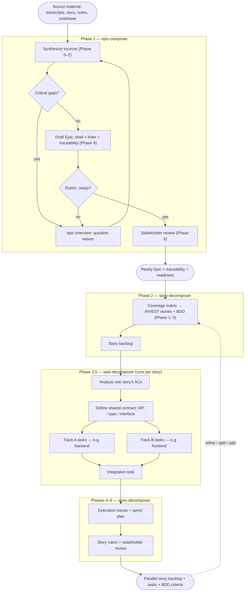

# Epic Scoping Skills

Reusable prompts, skills, and eval rubrics for building solid epics when
scoping new work. Migrated from the standalone `prompts-skills` project into
this repository; the skills, templates, and evals now live alongside the
harness templates and target the same three AI coding harnesses:
**Opencode**, **Claude Code**, and **GitHub Copilot**.

This is the full usage guide. `AGENTS.md` holds the concise cross-harness
entrypoint; the constitutional harness-generation system is documented in the
top-level `README.md` and `CLAUDE.md`.

## Architecture

Shared content lives in `.agents/` as plain markdown — no frontmatter, no
harness-specific fields. Each harness has its own thin, frontmatter-only
wrapper files that reference the shared content by path. Rules shared across
multiple skills and rubrics live in `.agents/doctrine/` and are referenced
rather than restated — this is what keeps the skills from drifting apart.

```
.agents/   Shared content — skills, doctrine, templates, evals   ← EDIT HERE
   │  ├── skills/     epic-* skills (procedure + doctrine pointers)
   │  ├── doctrine/   shared rules referenced by multiple skills and rubrics
   │  ├── templates/  epic/story/traceability shells
   │  └── evals/      readiness rubrics (assess against doctrine, don't restate)
   │
   │  wrapped by thin, frontmatter-only pointers per harness:
   ├── Opencode        .opencode/skills/<name>/SKILL.md   + opencode.json commands
   ├── Claude Code     .claude/skills/<name>/SKILL.md     (skills double as /commands)
   └── GitHub Copilot  .github/skills/<name>/SKILL.md
```

The full file tree is under [Layout](#layout).

**Golden rule:** Edit content in `.agents/`. Edit frontmatter in the harness
wrappers. Never duplicate content into a wrapper. When a rule is shared by
two or more skills/rubrics, it belongs in `.agents/doctrine/` — edit there
once; all references inherit.

## Layout

```
.agents/                          # Shared content — edit here
  skills/
    epic-composer.md               # Main skill body
    epic-acceptance-linter.md      # Acceptance criteria linter body (canonical AC-rules applier)
    epic-interview.md              # Guided interview body
    story-decomposer.md            # Story decomposition body
    task-decomposer.md             # Task breakdown + AI-parallelization body
  doctrine/                        # Shared rules referenced by multiple skills and rubrics
    acceptance-criteria-rules.md   # The six AC linting rules — single source
    parallelization-doctrine.md   # Contract → tracks/waves → integration
    ai-readable-spec-rules.md      # Name files/APIs, exists-vs-new, no pronouns
    source-discipline.md           # Don't invent / surface unknowns / label inferred
    review-checkpoint.md           # Present → ask → incorporate → declare-or-loop
    context-discovery.md           # Greenfield/brownfield probe
  templates/epic/
    epic-shell.md                  # Epic structural skeleton
    story-shell.md                 # Story backlog structural skeleton
    traceability-template.md       # Traceability table template
  evals/
    epic-rubric.md                 # Epic readiness rubric
    story-rubric.md                # Story readiness rubric (INVEST)

AGENTS.md                          # Cross-harness entrypoint

.opencode/
  opencode.json                   # Config: skills.paths -> .opencode/skills
  skills/                          # Opencode wrappers (frontmatter only)
    epic-composer/SKILL.md
    epic-acceptance-linter/SKILL.md
    epic-interview/SKILL.md
    story-decomposer/SKILL.md
    task-decomposer/SKILL.md
  plugins/                         # Opencode hooks (JS/TS plugins)
    warn-pointer-edit.ts

.claude/
  CLAUDE.md                        # Imports AGENTS.md only (rest on-demand)
  settings.json                   # hooks configuration
  skills/                          # Claude Code skill wrappers (also serve as /commands)
    epic-composer/SKILL.md
    epic-acceptance-linter/SKILL.md
    epic-interview/SKILL.md
    story-decomposer/SKILL.md
    task-decomposer/SKILL.md
  hooks/                           # Claude Code hooks (shell scripts)
    log-instructions-loaded.sh
    warn-pointer-edit.sh

.github/
  copilot-instructions.md         # Copilot pointer (auto-loaded)
  skills/                          # Copilot skill wrappers
    epic-composer/SKILL.md
    epic-acceptance-linter/SKILL.md
    epic-interview/SKILL.md
    story-decomposer/SKILL.md
    task-decomposer/SKILL.md
  hooks/                           # Copilot hooks
    warn-pointer-edit.json         # Hook config (bash + powershell)
    scripts/
      warn-pointer-edit.sh         # Shell implementation (macOS/Linux)
      warn-pointer-edit.ps1        # PowerShell implementation (Windows)
```

## Workflow

Three skills hand off in sequence — epic-composer → story-decomposer →
task-decomposer — with each story fanning out into parallel-structured tasks.



### Response states

Each skill labels its output with one of these states (`→` marks a progression;
`/` marks alternatives):

- **epic-composer:** `SYNTHESIS_ONLY` → `INTERVIEW_REQUIRED` → `PARTIAL_EPIC` → `FINAL_EPIC`
- **epic-acceptance-linter:** `PASS` / `NEEDS_REVISION` / `BLOCKED`
- **epic-interview:** `QUESTIONS_PENDING` / `PARTIALLY_RESOLVED` / `RESOLVED`
- **story-decomposer:** `EPIC_NOT_READY` / `DECOMPOSITION_PLANNED` / `STORIES_DRAFTED` / `TASKS_ADDED` / `READY_FOR_IMPLEMENTATION` / `NEEDS_REVISION` / `REFINEMENT_IN_PROGRESS`
- **task-decomposer:** `NEEDS_ACCEPTANCE_CRITERIA` / `PARALLELIZATION_PLANNED` / `TASKS_DRAFTED` / `TASKS_LINTED` / `READY`

## Harness setup

Every skill can be invoked **two ways**:

- **Directly** — type its slash command (the same name in every harness; see
  the [command table](#example-workflows)).
- **Automatically** — the harness loads the matching skill when your request
  fits its `description` (and `when_to_use`, where supported), so you can just
  describe your goal without naming a command.

### Opencode

- **Directly:** `/epic-composer`, `/epic-interview`, `/epic-acceptance-linter`,
  `/story-decomposer`, `/task-decomposer` — `command` entries in `opencode.json`
  (Opencode skills are model-invoked only, so the commands are the slash path).
- **Automatically:** skills in `.opencode/skills/<name>/SKILL.md` are discovered
  by their `name`/`description`; `permission.skill` allows them.
- Config: `opencode.json` sets `skills.paths` → `.opencode/skills` and
  `instructions` → `AGENTS.md`. Frontmatter is `name`/`description` only, and
  `name` must match the directory. Restart Opencode after changing config.
- Docs: [Opencode Skills](https://opencode.ai/docs/skills)

### Claude Code

- **Directly:** `/epic-composer`, `/epic-acceptance-linter`, `/epic-interview`,
  `/story-decomposer`, `/task-decomposer` — skills double as slash commands and
  accept `$ARGUMENTS`.
- **Automatically:** Claude loads a skill when your request matches its
  `description`/`when_to_use` — no command needed.
- Config: `.claude/CLAUDE.md` imports `AGENTS.md` (everything else loads on
  demand); skills auto-discover from `.claude/skills/` with no enable flag.
  Frontmatter is `name`, `description`, `when_to_use`.
- Docs: [Claude Code Skills](https://code.claude.com/docs/en/skills)

### GitHub Copilot

- **Directly:** in Copilot Chat, type `/` and pick a skill (`/epic-composer`,
  `/epic-interview`, `/epic-acceptance-linter`, `/story-decomposer`,
  `/task-decomposer`) — skills appear in the `/` menu.
- **Automatically:** skills in `.github/skills/<name>/SKILL.md` also auto-load
  when your request matches their `description`; `.github/copilot-instructions.md`
  is always in context. (Set `user-invocable: false` or
  `disable-model-invocation: true` on a skill to restrict it to one mode.)
- Config: skill frontmatter is `name`/`description`.
- Docs: [Agent Skills](https://code.visualstudio.com/docs/agent-customization/agent-skills)

## Hooks

The hooks matter only when **editing this repo** — they don't affect using the
skills. Each harness ships a non-blocking "pointer-edit" guardrail that
enforces the golden rule: it fires a reminder (warns; never blocks) if you try
to edit a thin wrapper (in `.opencode/`, `.claude/`, or `.github/`) instead of
the canonical content in `.agents/`, **or** if you edit a load-bearing file
under `.agents/doctrine/` — those are referenced by path from multiple
skills and rubrics, so edits there propagate everywhere.

| Harness | Config | Event | Mechanism |
|---|---|---|---|
| Opencode | `.opencode/plugins/warn-pointer-edit.ts` | `tool.execute.before` | TS plugin; logs a warning via `client.app.log` |
| Claude Code | `.claude/hooks/warn-pointer-edit.sh` | `PreToolUse` (Edit\|Write) | Shell script; returns an `additionalContext` reminder |
| GitHub Copilot | `.github/hooks/warn-pointer-edit.json` + `scripts/*.sh`/`*.ps1` | `preToolUse` | JSON config + bash/PowerShell script; warns to stderr |

Claude Code additionally runs an `InstructionsLoaded` hook that logs which
instruction files load (to `.claude/hooks/instructions-loaded.log`) — purely for
observability; safe to remove.

Docs: [Opencode plugins](https://opencode.ai/docs/plugins) ·
[Claude Code hooks](https://code.claude.com/docs/en/hooks) ·
[Copilot hooks](https://docs.github.com/en/copilot/reference/hooks-reference)

## Example workflows

Each task uses the **same slash command in every harness** — the skill's name:

| Task | Command |
|------|---------|
| Compose an Epic | `/epic-composer` |
| Close gaps (interview) | `/epic-interview` |
| Lint acceptance criteria | `/epic-acceptance-linter` |
| Decompose Epic → stories | `/story-decomposer` |
| Story → tasks | `/task-decomposer` |

Type the command from the `/` menu, then paste your content after it — or just
describe your goal and let the matching skill auto-load from its `description`.
(In Opencode these names are `command` entries in `opencode.json`; in Claude
Code and Copilot they are the skills themselves.)

To adapt any example, replace the **[bracketed placeholder]** with your own
material and keep the rest.

---

### 1. Compose an Epic from source material

**Use when** you have raw transcripts, docs, or notes and want a structured,
traceable Epic.

Run the **Compose an Epic** command and paste your source material:

```
[Paste everything you have: meeting transcripts, product docs, business
goals, constraints, rough notes. More context = fewer follow-up questions.]

--- example ---
Planning meeting, 2024-01-15
PM:  Users can only export reports as CSV and keep asking for PDF.
Eng: The export pipeline is synchronous — large PDFs will time out.
PM:  Scope it to reports under 500 rows for the first release.
Product doc v2, §3.1: "Users can export reports in PDF and CSV. PDF export
applies to standard report templates."
```

**You get** a drafted Epic — current/future state, MVP vs. Phase-2 scope, NFRs,
outcome-focused acceptance criteria, a traceability map, and a readiness score
— after the skill asks the 2–3 critical questions it couldn't answer from your
material.

> **Brownfield?** Run this inside an existing codebase and Phase 0 also reads
> your `AGENTS.md`/`README`, package manifest, and test conventions, recording
> them as Project Constraints — no extra input needed.

---

### 2. Close gaps on a rough Epic draft (interview)

**Use when** you have a partial Epic and want to know what's missing before
finalizing.

Run the **Close gaps** command and paste your draft:

```
Epic: [one-line title]
Problem: [what's broken today]
Scope: [what's in / out]
Acceptance: [any criteria you have so far]

--- example ---
Epic: PDF Export for Reports
Problem: Users can only export CSV today.
Scope: PDF export for reports under 500 rows.
Acceptance: Users can export a report as PDF.
```

**You get** targeted questions in waves — critical blockers first (auth,
success metrics, edge cases), then clarifiers — with anything you can't answer
marked `[BLOCKED]`. The skill closes gaps; it does not rewrite the Epic.

---

### 3. Lint acceptance criteria

**Use when** you have acceptance criteria and want a quality pass.

Run the **Lint acceptance criteria** command and paste your criteria:

```
[Paste your acceptance criteria, one per line.]

--- example ---
AC1: Users can export reports as PDF.
AC2: The export is fast.
AC3: PDF export works for all report types.
AC4: The system handles errors gracefully.
```

**You get** a per-criterion review flagging vague terms ("fast" — no
threshold), unobservable outcomes ("gracefully"), and scope conflicts (AC3 vs.
a 500-row limit), plus strengthened rewrites and a `PASS` / `NEEDS_REVISION` /
`BLOCKED` verdict.

---

### 4. Decompose a ready Epic into stories

**Use when** your Epic passed readiness and you want an implementable,
parallel-first backlog. The Epic's acceptance criteria are what get decomposed.

Run the **Decompose Epic** command and paste the Epic:

```
Epic: [title]
Readiness: Ready for Decomposition
AC1: When [trigger], then [observable outcome], so that [value].
AC2: ...
NFR: [any performance / security / etc. constraints]

--- example ---
Epic: PDF Export for Reports
Readiness: Ready for Decomposition
AC1: When a user exports a report under 500 rows, then the system produces a
PDF within 10 seconds, so that the user does not wait or retry.
AC2: When a user selects PDF format, then the export uses the standard report
template, so that output is consistent across reports.
AC3: When a PDF export fails, then the user sees an error with a retry option,
so that they can recover without losing context.
NFR: PDF generation < 10s p95 for reports under 500 rows.
```

**You get** a coverage matrix (every AC mapped to stories), INVEST-compliant
stories with BDD criteria and traceability, a wave-grouped execution sequence
(what runs in parallel vs. what must wait), a sprint plan, and a readiness
score. Task breakdowns are added automatically via task-decomposer (Phase 3.5).

---

### 5. Break a story into AI-executable tasks

**Use when** you have a drafted story and want concrete engineering tasks an AI
agent can implement. The story must include acceptance criteria.

Run the **Story → tasks** command and paste the story:

```
Story: [title]
As a [user], I want [action], so that [value].
AC1: Given [context], when [action], then [outcome].
AC2: ...
Estimate: [S / M / L]
Feature flag: [name, if any]

--- example ---
Story: Export small report as PDF
As a report viewer, I want to export a report as PDF, so that I can share it
with stakeholders.
AC1: Given a report under 500 rows, when the user clicks "Export as PDF", then
the system generates and downloads a PDF within 10 seconds.
AC2: Given the PDF service is unavailable, when the user clicks "Export as
PDF", then the system shows an error with a retry button.
Estimate: S
Feature flag: pdf_export_enabled
```

**You get** tasks structured for parallelism: a shared contract (e.g. the
`POST /api/reports/{id}/export` response shape), independent backend and
frontend tracks with named files and test paths, and a final integration task
— each with Context / Verify / AC fields, plus a parallelization assessment.

---

### Chaining the skills end-to-end

The skills hand off in sequence; run them in order and review at each
checkpoint:

1. **Compose** → a structured Epic (the skill pauses for your review at Phase 6).
2. **Decompose** the ready Epic → a story backlog grouped into parallel waves.
3. **Tasks** — task lists are already attached to each story from step 2.
4. Dispatch parallel stories and tracks to AI agents simultaneously.

You rarely run all five commands by hand: epic-composer offers the decompose
handoff automatically once an Epic scores "Ready for Decomposition," and
story-decomposer runs task-decomposer as part of Phase 3.5 — so one decompose
run already includes task breakdowns.

### Refining a backlog later

Return to the **Decompose Epic** command any time to groom the backlog, split
an in-progress story, or add one. For a mid-sprint split, describe what's done
and what's left:

```
Story 2 (Handle large report boundary) is in progress. PDF generation for
reports over 500 rows is timing out. Story 1 (basic export for small reports)
is complete. Split the remaining work.
```

The decomposer preserves completed work, creates new stories for the
remainder, re-runs task breakdown on them, and re-maps dependencies and sprints.
